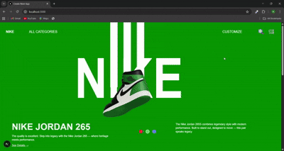

This is a [Next.js](https://nextjs.org) project bootstrapped with [`create-next-app`](https://nextjs.org/docs/app/api-reference/cli/create-next-app).

## Getting Started

First, run the development server:

npm run dev

# or

yarn dev

# or

pnpm dev

# or

bun dev

```

Open [http://localhost:3000](http://localhost:3000) with your browser to see the result.

You can start editing the page by modifying `app/page.tsx`. The page auto-updates as you edit the file.

This project uses [`next/font`](https://nextjs.org/docs/app/building-your-application/optimizing/fonts) to automatically optimize and load [Geist](https://vercel.com/font), a new font family for Vercel.

## Learn More

To learn more about Next.js, take a look at the following resources:

- [Next.js Documentation](https://nextjs.org/docs) - learn about Next.js features and API.
- [Learn Next.js](https://nextjs.org/learn) - an interactive Next.js tutorial.

You can check out [the Next.js GitHub repository](https://github.com/vercel/next.js) - your feedback and contributions are welcome!

## Deploy on Vercel

The easiest way to deploy your Next.js app is to use the [Vercel Platform](https://vercel.com/new?utm_medium=default-template&filter=next.js&utm_source=create-next-app&utm_campaign=create-next-app-readme) from the creators of Next.js.

Check out our [Next.js deployment documentation](https://nextjs.org/docs/app/building-your-application/deploying) for more details.
👟 Nike GSAP Animation – Next.js + GSAP

A Nike-inspired animated landing page built with Next.js, GSAP, and Tailwind CSS.
The project features scroll-triggered animations, smooth transitions, and dynamic shoe color variants for a modern and interactive experience.

🔗 Live Demo: Nike GSAP Animation

## 🧩 Features

## 🎨 Landing Page

GSAP-powered animations (scroll, fade, rotate)

Responsive design for desktop and mobile

Dynamic shoe color switching (Red, Green, Blue)

Bold Nike-styled typography

## ⚡ Animations

ScrollTrigger Effects for text and images

Smooth transitions on shoe hover and movement

Pinned sections with scroll-based motion

## 🛠️ Tech Stack

Framework: Next.js

Styling: Tailwind CSS

Animations: GSAP + ScrollTrigger

Icons: Lucide React

## ⚙️ Installation

Clone the repo

git clone https://github.com/your-username/next-gsap-nike-animation.git
cd next-gsap-nike-animation


Install dependencies

npm install


Run the dev server

npm run dev


##  Open in browser
👉 http://localhost:3000

## 🎥 Demo GIF



## 🙋‍♀️ Author

Nikita Sain
Check out my GitHub for more projects: @NikitaSain20

🔗 GitHub

## 📌 Future Improvements

 Add more product variants

 Add cart/checkout functionality

 Improve accessibility (ARIA roles)

 Enhance mobile animations
```
