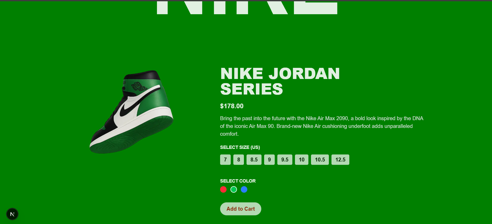

A Nike-inspired animated landing page built with Next.js, GSAP, and Tailwind CSS.
The project features scroll-triggered animations, smooth transitions, and dynamic shoe color variants for a modern and interactive experience.

🔗 Live Demo: Nike GSAP Animation

## 🧩 Features

## 🎨 Landing Page

GSAP-powered animations (scroll, fade, rotate)

Responsive design for desktop and mobile

Dynamic shoe color switching (Red, Green, Blue)

Bold Nike-styled typography

## ⚡ Animations

ScrollTrigger Effects for text and images

Smooth transitions on shoe hover and movement

Pinned sections with scroll-based motion

## 🛠️ Tech Stack

Framework: Next.js

Styling: Tailwind CSS

Animations: GSAP + ScrollTrigger

Icons: Lucide React

## 📸 Screenshots

  
  

## ⚙️ Installation

Clone the repo

git clone https://github.com/NikitaSain20/Next-Gsap-Nike-Animation
cd next-gsap-nike-animation

Install dependencies

npm install

Run the dev server

npm run dev

## Open in browser

👉 http://localhost:3000

## 🙋‍♀️ Author

Nikita Sain
Check out my GitHub for more projects: @NikitaSain20

🔗 GitHub

## 📌 Future Improvements

Add more product variants

Add cart/checkout functionality
